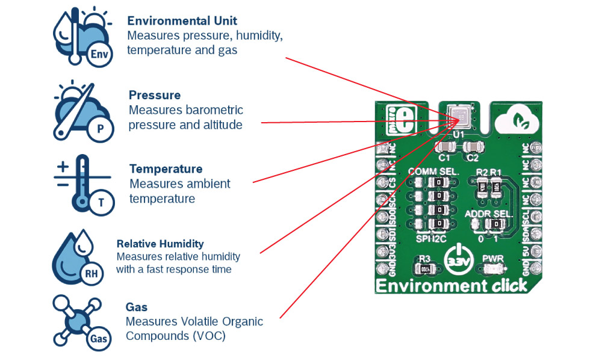

<iframe src="./naslovna_stranica.html" style="width: 100%; height: 100%; border: none;"></iframe>

# Sadržaj <!-- omit in toc -->
- [I  Uvod](#1-uvod)
- [II  Teorijski okvir](#2-teorijski-okvir)
  - [1. Osnovni termini i oblast u kojoj se praksa radi](#21-osnovni-termini-i-oblast-u-kojoj-se-praksa-radi)
    - [1.1. Embedded programiranje](#211-embedded-programiranje)
    - [1.2. Internet of Things](#212-internet-of-things)
    - [1.3. Cloud computing - računarstvo u oblaku  //TODO](#213-cloud-computing---računarstvo-u-oblaku--todo)
  - [2. Organizacija rada](#22-organizacija-rada)
    - [2.1. Struktura ljudi](#221-struktura-ljudi)
    - [2.2. Sastanci - tehnički deo](#222-sastanci---tehnički-deo)
    - [2.3. Sastanci - netehnički deo](#223-sastanci---netehnički-deo)
  - [3. Ključni korišćeni alati](#23-ključni-korišćeni-alati)
    - [3.1. Arduino ekosistem](#231-arduino-ekosistem)
    - [3.2. Qt Framework //TODO](#232-qt-framework-todo)
- [III  Sadržaj projekta //TODO](#3-sadržaj-projekta-todo)
  - [1. Šira slika projekta //TODO](#31-šira-slika-projekta-todo)
    - [1.1. Primer primene, davanje konteksta //TODO](#311-primer-primene-davanje-konteksta-todo)
    - [1.2. Korišćeni alati (upitno da li treba uz ključne) //TODO](#312-korišćeni-alati-upitno-da-li-treba-uz-ključne-todo)
  - [2. Struktura projekta - hardware](#32-struktura-projekta---hardware)
    - [2.1. Arduino razvojna ploča i firmware](#321-arduino-razvojna-ploča-i-firmware)
      - [2.1.1. Arduino Uno](#3211-arduino-uno)
      - [2.1.2. Shields i clicks](#3212-shields-i-clicks)
    - [2.2. Raspberry Pi kao posrednik //TODO](#322-raspberry-pi-kao-posrednik-todo)
    - [2.3. "Hardver" cloud platforme? //TODO](#323-hardver-cloud-platforme-todo)
    - [2.4. Hardver krajnjeg korisnika //TODO](#324-hardver-krajnjeg-korisnika-todo)
  - [3. Struktura projekta - sofware //TODO](#33-struktura-projekta---sofware-todo)
    - [3.1. Arduino firmware](#331-arduino-firmware)
    - [3.2. Raspberry Pi Cloud Client //TODO](#332-raspberry-pi-cloud-client-todo)
    - [3.3. WolkAbout Cloud platforma //TODO](#333-wolkabout-cloud-platforma-todo)
    - [3.4. PC (ili Android) Data Visualizer //TODO](#334-pc-ili-android-data-visualizer-todo)
- [IV  Zaključak //TODO](#4-zaključak-todo)
- [V  Literatura](#5-literatura)

---

# I  Uvod
Praksu sam obavio u kompaniji [**Execom**](execom.eu), koju je u međuvremenu kupio [**HTEC**](). U pitanju je *outsourcing* kompanija koja ima niz timova, svaki od kojih radi na uglavnom jednom projektu za eksternog klijenta. Timovi se bave različitim tehnologijama, u zavisnosti od potreba klijenta.

Kao i svaka *outsourcing* kompanija, nema svoje interne projekte, već ih isključivo uslužno pravi za druge. Važno je napomenuti da je njihov nekadašnji interni projekat prerastao u tzv. *spin off* kompaniju [**WolkAbout**](), čije cloud tehnologije smo koristili na projektu koji sam izradio.

Tim u koji sam primljen bavi se sa **IoT** (*Internet of Things*) i **Embedded** tehnologijama i u tom momentu je radio sa dva različita klijenta na proizvodima koji su njima bili potrebni, o čijim detaljima ne mogu govoriti zbog NDA (Non-disclosure agreement) koji sam potpisao.

Srećom, projekat na kojem sam radio je smišljen od nule isključivo u edukativne, odnosno svrhe moje prakse, te o njemu mogu govoriti. Projekat je open-source i njegov kod je javno dostupan na mom ličnom GitHub profilu. 

Budući da ove oblasti (a posebno embedded) zahtevaju visok nivo performansi, izabran je programski jezik **C++**. Njegova prednost u odnosu na **C** jeste prisustvo Objektno-orijentisane paradigme, koja nam je olakšala organizaciju koda. 

Takođe korišćen je i **Qt Framework** za *crossplatform GUI* aplikaciju, koji je u potpunosti objektno-orijentisan.

# II  Teorijski okvir
## 2.1. Osnovni termini i oblast u kojoj se praksa radi
### 2.1.1. Embedded programiranje
**Embedded softver** (od engl. *embed*, "usaditi") je računarski softver, napisan da kontroliše mašine ili uređaje koji se obično ne smatraju računarima u punom smislu te reči, poznatim kao embedded sistemi. Tipično su specijalizovani za određenu hardversku platformu na kojoj rade i imaju vremenska i memorijska ograničenja.[^1] Ovaj termin se ponekad koristi naizmenično sa **firmware**-om.[^3]

Hardver na kojem se nalazi embedded softver, zbog prostornih ograničenja ili energetskih ograničenja, je generalno manji i ne preterano moćan, zbog čega je efikasnost softvera izuzetno važna.

Primeri gde se ovakav sofver koristi:
1. elektroniku automobila
2. modemi
3. "mozak" robota
4. kućni aparati (posebno "pametni")
5. igračke
6. sigurnosni sistemi
7. automatizovani sistemi proizvodnje.[^2] 

Ovaj softver može biti vrlo jednostavan, kao što su sistemi za kontrolu osvetljenja koji rade na 8-bitnom mikrokontroleru sa nekoliko kilobajta memorije. Međutim, embedded softver može postati vrlo sofisticiran u aplikacijama kao što su ruteri, optički mrežni elementi, avioni, rakete i sistemi za kontrolu procesa.[^4]

### 2.1.2. Internet of Things
**Internet of Things** (IoT) odnosi se na mrežu fizičkih uređaja, vozila, aparata i drugih fizičkih objekata koji su opremljeni senzorima i/ili aktuatorima (motorima), softverom i mrežnom povezanošću koji im omogućavaju prikupljanje i deljenje podataka. Ovi uređaji — poznati i kao "**pametni objekti**" — mogu varirati od jednostavnih "pametnih kuća" uređaja poput pametnih termostata, do nosivih uređaja kao što su pametni satovi i odeća sa RFID tehnologijom, do složenih industrijskih mašina i transportnih sistema. Tehnolozi čak zamišljaju čitave "pametne gradove" zasnovane na IoT tehnologijama.[^5]

Drugim rečima, IoT je sve ono što nekolicinu embedded uređaja, pomoću računarskih mreža (bežične i žičane veze) uvezuje u jedan širi, inteligentan sistem. Posebna vrednost je u tome što slab embedded računar, može osnažiti resursima pravog računara sa kojim komunicira (lokalni računar). To je ono što ovakvom sistemu omogućuje autonomno reagovanje na uslove i obavljanje zadataka. Ova lokalna mreža uređaja može da se poveže sa internetom, a odatle sa pametnim telefonima ili stonim računarima na bilo kom kraju sveta.[^6]

To znači da IoT sistemi mogu raditi praktično bilo šta, poput:
1. praćenja ekoloških uslova na farmama
2. upravljanja saobraćajnim modelima pomoću pametnih automobila i drugih pametnih saobraćajnih uređaja
3. kontrole mašina i procesa u fabrikama
4. praćenja stanja pacijenta i pružanja adekvatne doze medikamenta
5. do praćenja inventara i pošiljki u skladištima.

Potencijalne primene IoT-a su ogromne i raznolike, a njegov uticaj se već oseća u svim granama industrije. Kako broj uređaja povezanih sa internetom nastavlja da raste, IoT će verovatno igrati sve važniju ulogu u oblikovanju našeg sveta i transformaciji načina na koji živimo, radimo i međusobno komuniciramo.[^5] IoT takođe podstiče gomilanje podataka koji se mogu koristiti u treniranju modela veštačke inteligencije. [^7]

U najčešćim primenama u većim preduzećima, IoT uređaji se koriste za praćenje širokog spektra parametara kao što su temperatura, vlažnost, kvalitet vazduha, potrošnja energije i performanse mašina. Ovi podaci mogu se analizirati u realnom vremenu kako bi se identifikovali obrasci, trendovi i anomalije koji mogu pomoći preduzećima da optimizuju svoje operacije i poboljšaju svoju profitabilnost.[^5] 

### 2.1.3. Cloud computing - računarstvo u oblaku  //TODO 

## 2.2. Organizacija rada
Rad u timu je bio izuzetno kvalitetno organizovan u skladu sa vodećim principima u industriji. Takođe je važno napomenuti da ne samo da su uspešno implementirani, nego da su i međuljudski odnosi bili na visokom nivou. Bilo je tolerancije i razumevanja, što je značajno pomoglo prevazilaženju bilo kojih tehničkih problema.
### 2.2.1. Struktura ljudi
U odnosu na mojih prvih mesec dana u Execomu, gde sam prve sedmice imao jednog mentora (koji je kasnije uključio još jednog mentora za svakodnevnu komunikaciju i razjašnjavanje/rešavanje problema), u drugih mesec dana sam imao sreću raditi sa čak dvojicom mentora i vođom tima (koji je rukovodio projektom, vodio mentore i pomagao kad se oni susretnu sa poteškoćama).

Budući da se drugi projekat sastojao iz više delova, te da je bio veoma obiman za mesec dana rada, veći broj mentora je bio od presudnog značaja za uspešno obavljanje svih zamišljenih radnih zaduženja na projektu.

Budući da je svaki deo predstavljao gotovo skroz nezavistan komad softvera, ukoliko bi došlo do prepreke na jednom, mogao sam to iskomunicirati sa mentorima i jednostavno preći na drugi dok oni to rešavaju. Ovim sistemom smo svi bili veoma zadovoljni i nismo imali "praznog hoda".
### 2.2.2. Sastanci - tehnički deo
U kompaniji Execom korišćena je **Agile** metodologija, konkretnije **Scrum**. Ključan koncept su tzv *sprintovi*, odnosno period od 1-3 sedmice za koji se odredio spisak taskova koji moraju da se obave, kao i ko će šta da radi. Nakon što je sprint završen, radi se retrospektiva i proverava sa klijentom da li je zadovoljan. Ključ je u ciklusima rada i povratne informacije koji se brzu smenjuju. Time se sprečava situacija u kojoj tim dugo vremena radi na nečemu što zapravo korisniku ne treba.

To podrazumeva specifičnu dinamiku sastanaka, koji uključuju sve članove tima, uključujući product managera, scrum mastera i klijenta[^8]:
1. ***daily (meeting)*** (takođe *stand meeting*)
   - kratke sastanke svako (radno) jutro 
   - svaki član tima objasni šta je radio juče, šta će danas
   - feedback na to od strane šefa
2. ***weekly (meeting)***
    - uglavnom krajem sedmice
    - nešto duže sumacije do sada postignutog na nedeljnom nivou
    - nekad i tehničku demonstraciju (često neuglancanu) radi jasnije komunikacije šta je postignuto i da li odgovara potrebama klijenta

U slučaju moje prakse, klijenta nije bilo, mada bi se klijentom mogli smatrati svi mi članovi tima.

### 2.2.3. Sastanci - netehnički deo
Pored toga, za praktikante je postojala još jedna forma nedeljnih sastanaka sa jednim ili više HR (*human resources*) menadžera, sredinom radne sedmice, sa kojima se pratio i "ne-tehnički" deo prakse - utisci i zadovoljstvo praktikanta, uklapanje sa drugim članovima tima. Iako se on činio neformalnim, HR menadžerke su beležile teze o čemu se govorilo i povezivale su to sa utiscima mentora. 

## 2.3. Ključni korišćeni alati
### 2.3.1. Arduino ekosistem
<table><tr>
  <td style="border: none; padding: 0;">
    **Arduino** je italijanska *Open Source* kompanija i zajednica korisnika koja dizajnira i proizvodi mikrokontrolere i setove za izradu mikrokontrolera za izgradnju digitalnih uređaja.[^9] Arduino ploče su komercijalno dostupne na zvaničnoj web stranici ili preko ovlašćenih distributera.  Pored toga, postoje i njihovi klonovi (gotovo identičnog dizajna i strukture) velikog broja altenartivnih proizvođača (uglavnom iz Kine) i jednog bogatog i širokog ekosistema, kako harverski tako i softverski.
  </td>
  <td style="border: none; padding: 0;">
    <figure> 
                 
                <figcaption style="text-align:center;"> 
                    Slika 1: Logo kompanije Arduino 
                </figcaption> 
              </figure> 

  </td>
</tr></table>

 Razlog zašto je to moguće jeste u tome što su njihovi hardverski proizvodi su licencirani pod **CC BY-SA licencom**, dok je softver licenciran pod **GNU Lesser General Public License (LGPL)** ili **GNU General Public License (GPL)**, što omogućava bilo kome proizvodnju Arduino ploča i distribuciju softvera.

Dizajni Arduino ploča koriste različite mikroprocesore i kontrolere. Ploče su opremljene setovima digitalnih i analognih ulazno/izlaznih (I/O) pinova koji mogu biti povezani sa raznim ekspanzionim pločama (***shieldovi***) ili pločama za prototipiranje (***breadboards***) i drugim električnim kolima. 

Ploče imaju serijske komunikacione interfejse, tj na većini modela USB, koji se takođe koriste za učitavanje programa (firmwarea). Mikrokontroleri mogu biti programirani koristeći programerske jezike C i C++ (Embedded C), koristeći standardni API koji je poznat kao **Arduino programski jezik**, inspirisan jezikom Processing i koristi se sa modifikovanom verzijom Processing IDE-a. Pored korišćenja tradicionalnih alatki za kompilaciju, Arduino projekat pruža integrisano razvojno okruženje (***IDE***) i komandnu liniju razvijenu u Go-u.

Arduino projekat je započet 2005. godine kao alat za studente na Institutu za interakcijski dizajn Ivrea, Italija, sa ciljem da pruži jeftin i jednostavan način za početnike i profesionalce da stvaraju uređaje koji interaguju sa svojom okolinom koristeći senzore i aktuatore. Uobičajeni primeri takvih uređaja namenjeni su početnicima i hobistima, uključujući jednostavne robote, termostate i detektore pokreta.

Zbog toga su njihovi proizvodi izabrani za firmware (odnosno hardverski "najniži" sloj projekta, najbliži metalu), jer olakšavaju značajne glavobolje sa kojima se početnici susreću pri ulasku u IoT ili robotiku.
### 2.3.2. Qt Framework //TODO
# III  Sadržaj projekta //TODO
## 3.1. Šira slika projekta //TODO
### 3.1.1. Primer primene, davanje konteksta //TODO
### 3.1.2. Korišćeni alati (upitno da li treba uz ključne) //TODO
## 3.2. Struktura projekta - hardware
Projekat je uključivao tri zasebne hardverske komponente, svaku sa pratećim softverom koji je bilo potrebno isprogramirati. Tu je bila i četvrta komponenta, odnosno *cloud platforma* kompanije WolkAbout.

Sagledaćemo prvo redom šta je svaka od ovih hardverskih komponenti, a zatim ćemo istim redom proći kroz njihov prateći softver koji je razvijan na praksi.

<figure> 
                 
                <figcaption style="text-align:center;"> 
                    Slika 2: Šema strukture projekta: tri hardverske komponente označene sivom bojom, uz njihove uzajamne veze prikazane na slici 
                </figcaption> 
              </figure> 

### 3.2.1. Arduino razvojna ploča i firmware
#### 3.2.1.1. Arduino Uno
**Arduino Uno** je Open Source mikrokontrolerska ploča bazirana na Microchip ATmega328P, prvi put predstavljena 2010. godine. Ploča ima 14 digitalnih i 6 analognih I/O pinova i može se napajati putem USB kabla ili eksternog izvora napona između 7 i 20V.

<figure> 
                 
                <figcaption style="text-align:center;"> 
                    Slika 3: Fotografija Arduino Uno razvojne ploče 
                </figcaption> 
              </figure> 

Uno koristi isti mikrokontroler kao Arduino Nano, a ima iste konektore kao Arduino Leonardo. Programira se pomoću Arduino IDE preko USB tipa A kabla. Raspored i proizvodni fajlovi su dostupni pod Creative Commons licencom.

Reč "Uno" je izabrana da označi značajnu preradu u Arduino seriji i ova ploča je naslednik izdanja Duemilanove. Za komunikaciju koristi STK500 protokol, ali se razlikuje od prethodnih modela jer ne koristi FTDI USB-na-UART čip, već Atmega16U2 kao USB-na-serijski konverter.

#### 3.2.1.2. Shields i clicks
Koristili smo jedan od mnogobrojnih dostupnih *shieldova* da bismo olakšali konekcije sa drugim uređajima (izbegaavamo lemljenje žica ili mukotrpno gledanje tzv *pinout* šema konekcija/pinova). 

<figure> 
                 
                <figcaption style="text-align:center;"> 
                    Slika 4: Fotografija *Click shield* u primeni sa jednim click slotom popunjenim, a drugim praznim 
                </figcaption> 
              </figure> 

Izabrali smo **Click shield**, čija je glavna svha da omogućuje *click*-ove, odnosno male pločice sa individualnim senzorima koje imaju standardno oblikovan i dimenzioniran raspored pinova, koji (slično shieldu) jednostavno ulaze u uređaj bez upotrebe žica.

Koristili smo 2 "klika" domaćeg preduzeća MikroEletronika:  
1. Detektor temperature, vlage i pritiska vazduha. Takođe je bio prisutan i senzor zapaljivih organskih jedinjenja koji nismo koristili.   (***Environment click***)
2. **Bluetooth 4.0 (Low Energy)** odašiljač informacija.  

<table><tr>
  <td style="border: none; padding: 0;">
    <figure> 
                 
                <figcaption style="text-align:center;"> 
                    Slika 5: Fotografija environment click 
                </figcaption> 
              </figure> 

  </td>
  <td style="border: none; padding: 0;">
    <figure> 
                 
                <figcaption style="text-align:center;"> 
                    Slika 6: Fotografija BLE click 
                </figcaption> 
              </figure> 

  </td>
</tr></table>

### 3.2.2. Raspberry Pi kao posrednik //TODO

### 3.2.3. "Hardver" cloud platforme? //TODO
### 3.2.4. Hardver krajnjeg korisnika //TODO

## 3.3. Struktura projekta - sofware //TODO
### 3.3.1. Arduino firmware
Jednostavno povezivanje bilo kojeg eksternog uređaja, kao što su ovi klikovi, kako hardverski a tako i softverski je ključna odlika Arduino ekosistema. Da bismo iz firmwarea Arduino razvojne ploče slali komande u komponente, potrebno je jednostavno instalirati softverske pakete/ekstenzije namenjene za rad sa tim eksternim uređajem. Razlog zašto toliki dijapazon eksternih uređaja ima svoje paekte, leži u tome da je ceo ekosistem Open Source, te da mu bilo ko može doprinositi.

Za senzore vazduha koristio sam C biblioteke razvijene od kompanije Adafruit, koja je dosta zastupljena i prepoznata u ovoj branši, i to:
1. **Adafruit_BME680.h** - specijalizovan za Bosch-ov detektor BME680 korišćen na ovom *environment click*-u.
2. **Adafruit_Sensor.h** - osnovna biblioteka za sve vrste senzora, na koju se specijalizovane biblioteke oslanjaju.

Pored toga korišćene su još dve biblioteke za ove senzore (bme680.h, bme680_defs.h) u razvojnom procesu, ali u krajnjoj verziji nisu imale značajan uticaj.

Za Bluetooth komunikaciju niske energije (BLE - Bluetooth Low Energy) korišćena je biblioteka **BLEPerihperal.h**
### 3.3.2. Raspberry Pi Cloud Client //TODO
### 3.3.3. WolkAbout Cloud platforma //TODO
### 3.3.4. PC (ili Android) Data Visualizer //TODO

# IV  Zaključak //TODO
# V  Literatura
[^1]: ["Abstraction and the C++ machine model",  B. Stroustrup, 2005](http://www.stroustrup.com/abstraction-and-machine.pdf)  
[^2]: ["Embedded Systems Methods and Technologies", R. Oshana, 2012](https://web.archive.org/web/20131029203328/http://www.computer.org/portal/web/certification/Embedded-Systems)  
[^3]: ["Towards Automated Dynamic Analysis for Linux-based Embedded Firmware", D. Chen et al, 2016](https://www.ndss-symposium.org/wp-content/uploads/2017/09/towards-automated-dynamic-analysis-linux-based-embedded-firmware.pdf)  
[^4]: ["Embedded Software", E. Lee, 2001](https://ptolemy.berkeley.edu/publications/papers/02/embsoft/embsoftwre.pdf)  
[^5]: ["What is the internet of things?", IBM](https://www.ibm.com/topics/internet-of-things)  
[^6]: ["An Internet of Things (IoT) architecture for embedded appliances", T. Yashiro et al, 2013](https://ieeexplore.ieee.org/abstract/document/6669062)  
[^7]: ["IoT, cloud, big data and AI in interdisciplinary domains", Y. Chen, 2020](https://www.sciencedirect.com/science/article/abs/pii/S1569190X20300083)  
[^8]: ["The 2020 Scrum Guide", J. Sutherland & K. Schwaber](https://scrumguides.org/scrum-guide.html)  
[^9]: ["Introduction to Arduino, A. Smith, 2011](https://web.archive.org/web/20180403132515/http://www.princeton.edu/~ffab/media___downloads_files/IntroArduinoBook.pdf)
[^10]: ["Old Software Releases", Zvaničan sajt kompanije Arduino, 2023](https://wiki-content.arduino.cc/en/software/OldSoftwareReleases)