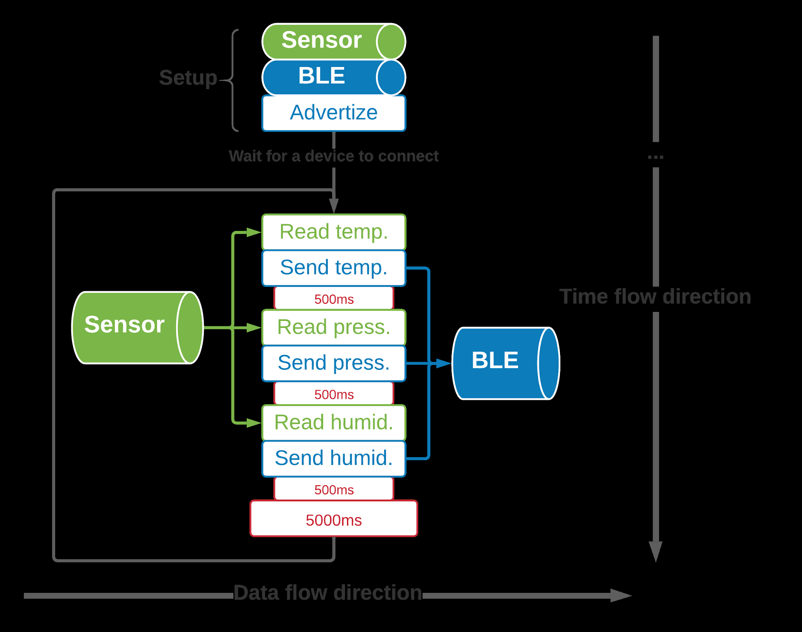

<iframe src="./naslovna_stranica.html" style="width: 100%; height: 100%; border: none;"></iframe>

## Sadržaj <!-- omit in toc -->
- [Uvod](#uvod)
- [Embedded programiranje](#embedded-programiranje)
- [Internet of Things](#internet-of-things)
- [Organizacija rada](#organizacija-rada)
  - [Sastanci - tehnički deo](#sastanci---tehnički-deo)
  - [Sastanci - netehnički deo](#sastanci---netehnički-deo)
  - [Struktura ljudi](#struktura-ljudi)
- [Struktura projekta](#struktura-projekta)
- [Rad na platformi](#rad-na-platformi)
- [Alati](#alati)
- [Konkretan zadatak, opis i implementacija](#konkretan-zadatak-opis-i-implementacija)
  - [Oblasti koje pokriva zadatak](#oblasti-koje-pokriva-zadatak)
  - [Koncepti koji se koriste](#koncepti-koji-se-koriste)
  - [Podešavanje okruženja](#podešavanje-okruženja)
  - [Postavka zadatak](#postavka-zadatak)
    - [Use Case](#use-case)
  - [Dijagram entiteta](#dijagram-entiteta)
  - [Poslovni Zahtevi](#poslovni-zahtevi)
    - [Automatizacija zahteva za održavanje](#automatizacija-zahteva-za-održavanje)
    - [Sinhronizacija sa eksternim servisom](#sinhronizacija-sa-eksternim-servisom)
  - [Konkretno rešenje zadatka](#konkretno-rešenje-zadatka)
- [Zaključak](#zaključak)
- [Literatura](#literatura)

## Uvod
Praksu sam obavio u kompaniji [**Execom**](execom.eu), koju je u međuvremenu kupio [**HTEC**](). U pitanju je *outsourcing* kompanija koja ima niz timova, svaki od kojih radi na uglavnom jednom projektu za eksternog klijenta. Timovi se bave različitim tehnologijama, u zavisnosti od potreba klijenta.

Kao i svaka *outsourcing* kompanija, nema svoje interne projekte, već ih isključivo uslužno pravi za druge. Važno je napomenuti da je njihov nekadašnji interni projekat prerastao u tzv. *spin off* kompaniju [**WolkAbout**](), čije cloud tehnologije smo koristili na projektu koji sam izradio.

Tim u koji sam primljen bavi se sa **IoT** (*Internet of Things*) i **Embedded** tehnologijama i u tom momentu je radio sa dva različita klijenta na proizvodima koji su njima bili potrebni, o čijim detaljima ne mogu govoriti zbog NDA (Non-disclosure agreement) koji sam potpisao.

Srećom, projekat na kojem sam radio je smišljen od nule isključivo u edukativne, odnosno svrhe moje prakse, te o njemu mogu govoriti. Projekat je open-source i njegov kod je javno dostupan na mom ličnom GitHub profilu. 

Budući da ove oblasti (a posebno embedded) zahtevaju visok nivo performansi, izabran je programski jezik **C++**. Njegova prednost u odnosu na **C** jeste prisustvo Objektno-orijentisane paradigme, koja nam je olakšala organizaciju koda. 

Takođe korišćen je i **Qt Framework** za *crossplatform GUI* aplikaciju, koji je u potpunosti objektno-orijentisan.

## Embedded programiranje
**Embedded softver** (od engl. *embed*, "usaditi") je računarski softver, napisan da kontroliše mašine ili uređaje koji se obično ne smatraju računarima u punom smislu te reči, poznatim kao embedded sistemi. Tipično su specijalizovani za određenu hardversku platformu na kojoj rade i imaju vremenska i memorijska ograničenja.[^1] Ovaj termin se ponekad koristi naizmenično sa **firmware**-om.[^3]

Hardver na kojem se nalazi embedded softver, zbog prostornih ograničenja ili energetskih ograničenja, je generalno manji i ne preterano moćan, zbog čega je efikasnost softvera izuzetno važna.

Primeri gde se ovakav sofver koristi:
1. elektroniku automobila
2. modemi
3. "mozak" robota
4. kućni aparati (posebno "pametni")
5. igračke
6. sigurnosni sistemi
7. automatizovani sistemi proizvodnje.[^2] 

Ovaj softver može biti vrlo jednostavan, kao što su sistemi za kontrolu osvetljenja koji rade na 8-bitnom mikrokontroleru sa nekoliko kilobajta memorije. Međutim, embedded softver može postati vrlo sofisticiran u aplikacijama kao što su ruteri, optički mrežni elementi, avioni, rakete i sistemi za kontrolu procesa.[^4]

## Internet of Things
**Internet of Things** (IoT) odnosi se na mrežu fizičkih uređaja, vozila, aparata i drugih fizičkih objekata koji su opremljeni senzorima i/ili aktuatorima (motorima), softverom i mrežnom povezanošću koji im omogućavaju prikupljanje i deljenje podataka. Ovi uređaji — poznati i kao "**pametni objekti**" — mogu varirati od jednostavnih "pametnih kuća" uređaja poput pametnih termostata, do nosivih uređaja kao što su pametni satovi i odeća sa RFID tehnologijom, do složenih industrijskih mašina i transportnih sistema. Tehnolozi čak zamišljaju čitave "pametne gradove" zasnovane na IoT tehnologijama.[^5]

Drugim rečima, IoT je sve ono što nekolicinu embedded uređaja, pomoću računarskih mreža (bežične i žičane veze) uvezuje u jedan širi, inteligentan sistem. Posebna vrednost je u tome što slab embedded računar, može osnažiti resursima pravog računara sa kojim komunicira (lokalni računar). To je ono što ovakvom sistemu omogućuje autonomno reagovanje na uslove i obavljanje zadataka. Ova lokalna mreža uređaja može da se poveže sa internetom, a odatle sa pametnim telefonima ili stonim računarima na bilo kom kraju sveta.[^6]

To znači da IoT sistemi mogu raditi praktično bilo šta, poput:
1. praćenja ekoloških uslova na farmama
2. upravljanja saobraćajnim modelima pomoću pametnih automobila i drugih pametnih saobraćajnih uređaja
3. kontrole mašina i procesa u fabrikama
4. praćenja stanja pacijenta i pružanja adekvatne doze medikamenta
5. do praćenja inventara i pošiljki u skladištima.

Potencijalne primene IoT-a su ogromne i raznolike, a njegov uticaj se već oseća u svim granama industrije. Kako broj uređaja povezanih sa internetom nastavlja da raste, IoT će verovatno igrati sve važniju ulogu u oblikovanju našeg sveta i transformaciji načina na koji živimo, radimo i međusobno komuniciramo.[^5] IoT takođe podstiče gomilanje podataka koji se mogu koristiti u treniranju modela veštačke inteligencije. [^7]

U najčešćim primenama u većim preduzećima, IoT uređaji se koriste za praćenje širokog spektra parametara kao što su temperatura, vlažnost, kvalitet vazduha, potrošnja energije i performanse mašina. Ovi podaci mogu se analizirati u realnom vremenu kako bi se identifikovali obrasci, trendovi i anomalije koji mogu pomoći preduzećima da optimizuju svoje operacije i poboljšaju svoju profitabilnost.[^5] 

## Organizacija rada
### Sastanci - tehnički deo
U kompaniji Execom korišćena je **Agile** metodologija, konkretnije **Scrum**. To je podrazumevalo kratke sastanke svako (radno) jutro tzv *daily*, kao i nešto duže sumacije do sada postignutog na nedeljnom nivou, tzv *weekly*, krajem sedmice. [^8]

### Sastanci - netehnički deo
Pored toga, za praktikante je postojala još jedna forma nedeljnih sastanaka sa jednim ili više HR (*human resources*) menadžera, sredinom radne sedmice, sa kojima se pratio i "ne-tehnički" deo prakse - utisci i zadovoljstvo praktikanta, uklapanje sa drugim članovima tima. Iako se on činio neformalnim, HR menadžerke su beležile teze o čemu se govorilo i povezivale su to sa utiscima mentora. 

### Struktura ljudi
U odnosu na mojih prvih mesec dana u Execomu, gde sam prve sedmice imao jednog mentora (koji je kasnije uključio još jednog mentora za svakodnevnu komunikaciju i razjašnjavanje/rešavanje problema), u drugih mesec dana sam imao sreću raditi sa čak dvojicom mentora i vođom tima (koji je rukovodio projektom, vodio mentore i pomagao kad se oni susretnu sa poteškoćama).

Budući da se drugi projekat sastojao iz više delova, te da je bio veoma obiman za mesec dana rada, veći broj mentora je bio od presudnog značaja za uspešno obavljanje svih zamišljenih radnih zaduženja na projektu.

## Struktura projekta
Projekat je uključivao tri zasebne hardverske komponente, svaku sa pratećim softverom koji je bilo potrebno isprogramirati. Tu je bila i četvrta komponenta, odnosno *cloud platforma* kompanije WolkAbout.

<figure> 
                 
                <figcaption style="text-align:center;"> 
                    Slika 1: Šema strukture projekta 
                </figcaption> 
              </figure> 

## Rad na platformi
## Alati
## Konkretan zadatak, opis i implementacija
### Oblasti koje pokriva zadatak
### Koncepti koji se koriste
### Podešavanje okruženja
### Postavka zadatak
#### Use Case
### Dijagram entiteta
### Poslovni Zahtevi
#### Automatizacija zahteva za održavanje
#### Sinhronizacija sa eksternim servisom
### Konkretno rešenje zadatka
## Zaključak
## Literatura
[^1]: ["Abstraction and the C++ machine model",  B. Stroustrup, 2005](http://www.stroustrup.com/abstraction-and-machine.pdf)  
[^2]: ["Embedded Systems Methods and Technologies", R. Oshana, 2012](https://web.archive.org/web/20131029203328/http://www.computer.org/portal/web/certification/Embedded-Systems)  
[^3]: ["Towards Automated Dynamic Analysis for Linux-based Embedded Firmware", D. Chen et al, 2016](https://www.ndss-symposium.org/wp-content/uploads/2017/09/towards-automated-dynamic-analysis-linux-based-embedded-firmware.pdf)  
[^4]: ["Embedded Software", E. Lee, 2001](https://ptolemy.berkeley.edu/publications/papers/02/embsoft/embsoftwre.pdf)  
[^5]: ["What is the internet of things?", IBM](https://www.ibm.com/topics/internet-of-things)  
[^6]: ["An Internet of Things (IoT) architecture for embedded appliances", T. Yashiro et al, 2013](https://ieeexplore.ieee.org/abstract/document/6669062)  
[^7]: ["IoT, cloud, big data and AI in interdisciplinary domains", Y. Chen, 2020](https://www.sciencedirect.com/science/article/abs/pii/S1569190X20300083)  
[^8]: ["The 2020 Scrum Guide", J. Sutherland & K. Schwaber](https://scrumguides.org/scrum-guide.html)  