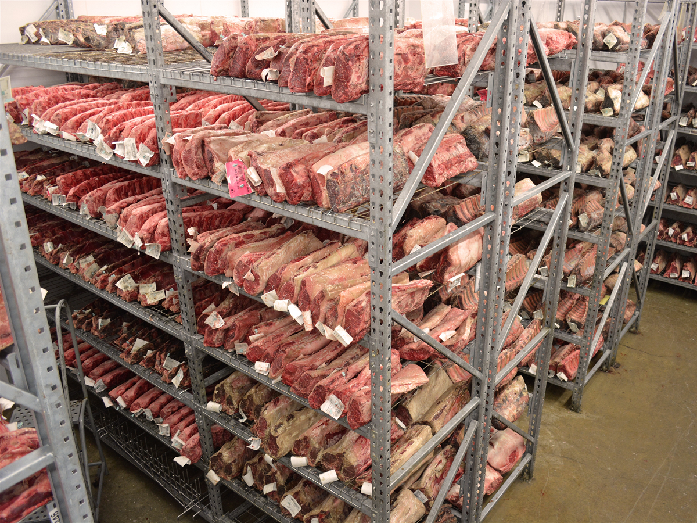
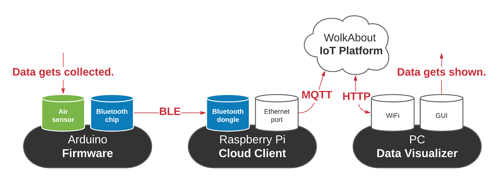
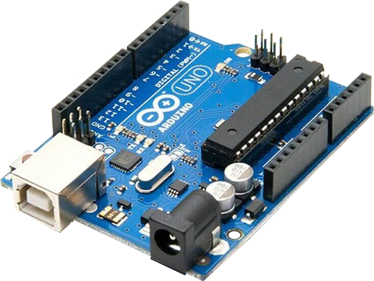

<iframe src="./naslovna_stranica.html" style="width: 100%; height: 100%; border: none;"></iframe>

# Sadržaj <!-- omit in toc -->
- [I  Uvod](#1-uvod)
- [II  Teorijski okvir](#2-teorijski-okvir)
  - [1. Osnovni termini i oblast u kojoj se praksa radi](#21-osnovni-termini-i-oblast-u-kojoj-se-praksa-radi)
    - [1.1. Embedded programiranje](#211-embedded-programiranje)
    - [1.2. Internet of Things](#212-internet-of-things)
    - [1.3. Cloud computing - računarstvo u oblaku](#213-cloud-computing---računarstvo-u-oblaku)
  - [2. Organizacija rada i tok prakse](#22-organizacija-rada-i-tok-prakse)
    - [2.1. Onboarding //](#221-onboarding-)
    - [2.2. Struktura ljudi](#222-struktura-ljudi)
    - [2.3. Sastanci - tehnički deo](#223-sastanci---tehnički-deo)
    - [2.4. Sastanci - netehnički deo](#224-sastanci---netehnički-deo)
    - [2.5. Finalna prezentacija](#225-finalna-prezentacija)
  - [3. Ključni korišćeni alati](#23-ključni-korišćeni-alati)
    - [3.1. Arduino ekosistem](#231-arduino-ekosistem)
    - [3.2. Qt Framework](#232-qt-framework)
- [III  Sadržaj projekta](#3-sadržaj-projekta)
  - [1. Šira slika projekta](#31-šira-slika-projekta)
    - [1.1. Primer primene, davanje konteksta (*use case*)](#311-primer-primene-davanje-konteksta-use-case)
    - [Primena 1 - spoljno praćenje vremenskih prilika, prognoza](#primena-1---spoljno-praćenje-vremenskih-prilika-prognoza)
    - [Primena 2 - unutrašnje praćenje i regulacija osetljivih procesa](#primena-2---unutrašnje-praćenje-i-regulacija-osetljivih-procesa)
    - [1.4. Korišćeni alati (upitno da li treba uz ključne) //TODO](#314-korišćeni-alati-upitno-da-li-treba-uz-ključne-todo)
  - [2. Struktura projekta](#32-struktura-projekta)
    - [2.1. Hardware](#321-hardware)
    - [2.2. Sofware](#322-sofware)
  - [3. Arduino - prvi korak, detekcija](#33-arduino---prvi-korak-detekcija)
    - [3.1. Hardware - Arduino Uno](#331-hardware---arduino-uno)
    - [3.2. Hardware - Shields i clicks](#332-hardware---shields-i-clicks)
    - [3.3. Software - Arduino firmware](#333-software---arduino-firmware)
  - [4. Raspberry Pi - posrednik](#34-raspberry-pi---posrednik)
    - [4.1. Hardware - Raspberry Pi](#341-hardware---raspberry-pi)
    - [4.2. Software - Raspberry Pi Cloud Client](#342-software---raspberry-pi-cloud-client)
  - [5. WolkAbout Cloud Platforma](#35-wolkabout-cloud-platforma)
    - [5.1. "Hardware" Cloud platforme?](#351-hardware-cloud-platforme)
    - [5.2. Software - konfigurisanje, povezivanje, monitoring](#352-software---konfigurisanje-povezivanje-monitoring)
  - [6. Krajnji korisnik](#36-krajnji-korisnik)
    - [6.1. Hardware - Windows, Linux, ...](#361-hardware---windows-linux-)
    - [6.2. Software - Cross-platform GUI Data Visualizer //TODO](#362-software---cross-platform-gui-data-visualizer-todo)
      - [MainWindow klasa](#mainwindow-klasa)
      - [Funkcije za komunikaciju](#funkcije-za-komunikaciju)
      - [JSON Parsing](#json-parsing)
      - [Grafički interfejs](#grafički-interfejs)
      - [Korisnička priča](#korisnička-priča)
- [IV  Zaključak](#4-zaključak)
- [V  Literatura](#5-literatura)

---
<div style="page-break-before: always;"></div>

# I  Uvod
Praksu sam obavio u kompaniji [**Execom**](execom.eu), koju je u međuvremenu kupio [**HTEC**](). U pitanju je *outsourcing* kompanija koja ima niz timova, svaki od kojih radi na uglavnom jednom projektu za eksternog klijenta. Timovi se bave različitim tehnologijama, u zavisnosti od potreba klijenta.

Kao i svaka *outsourcing* kompanija, nema svoje interne projekte, već ih isključivo uslužno pravi za druge. Važno je napomenuti da je njihov nekadašnji interni projekat prerastao u tzv. *spin off* kompaniju [**WolkAbout**](), čije cloud tehnologije smo koristili na projektu koji sam izradio.

Tim u koji sam primljen bavi se sa **IoT** (*Internet of Things*) i **Embedded** tehnologijama i u tom momentu je radio sa dva različita klijenta na proizvodima koji su njima bili potrebni, o čijim detaljima ne mogu govoriti zbog NDA (Non-disclosure agreement) koji sam potpisao.

Srećom, projekat na kojem sam radio je smišljen od nule isključivo u edukativne, odnosno svrhe moje prakse, te o njemu mogu govoriti. Projekat je open-source i njegov kod je javno dostupan na mom ličnom GitHub profilu. 

Budući da ove oblasti (a posebno embedded) zahtevaju visok nivo performansi, izabran je programski jezik **C++**. Njegova prednost u odnosu na **C** jeste prisustvo Objektno-orijentisane paradigme, koja nam je olakšala organizaciju koda. 

Takođe korišćen je i **Qt Framework** za *crossplatform GUI* aplikaciju, koji je u potpunosti objektno-orijentisan.

# II  Teorijski okvir
## 2.1. Osnovni termini i oblast u kojoj se praksa radi
### 2.1.1. Embedded programiranje
**Embedded softver** (od engl. *embed*, "usaditi") je računarski softver, napisan da kontroliše mašine ili uređaje koji se obično ne smatraju računarima u punom smislu te reči, poznatim kao embedded sistemi. Tipično su specijalizovani za određenu hardversku platformu na kojoj rade i imaju vremenska i memorijska ograničenja.[^1] Ovaj termin se ponekad koristi naizmenično sa **firmware**-om.[^3]

Hardver na kojem se nalazi embedded softver, zbog prostornih ograničenja ili energetskih ograničenja, je generalno manji i ne preterano moćan, zbog čega je efikasnost softvera izuzetno važna.

Primeri gde se ovakav sofver koristi:
1. elektroniku automobila
2. modemi
3. "mozak" robota
4. kućni aparati (posebno "pametni")
5. igračke
6. sigurnosni sistemi
7. automatizovani sistemi proizvodnje.[^2] 

Ovaj softver može biti vrlo jednostavan, kao što su sistemi za kontrolu osvetljenja koji rade na 8-bitnom mikrokontroleru sa nekoliko kilobajta memorije. Međutim, embedded softver može postati vrlo sofisticiran u aplikacijama kao što su ruteri, optički mrežni elementi, avioni, rakete i sistemi za kontrolu procesa.[^4]

### 2.1.2. Internet of Things
**Internet of Things** (IoT) odnosi se na mrežu fizičkih uređaja, vozila, aparata i drugih fizičkih objekata koji su opremljeni senzorima i/ili aktuatorima (motorima), softverom i mrežnom povezanošću koji im omogućavaju prikupljanje i deljenje podataka. Ovi uređaji — poznati i kao "**pametni objekti**" — mogu varirati od jednostavnih "pametnih kuća" uređaja poput pametnih termostata, do nosivih uređaja kao što su pametni satovi i odeća sa RFID tehnologijom, do složenih industrijskih mašina i transportnih sistema. Tehnolozi čak zamišljaju čitave "pametne gradove" zasnovane na IoT tehnologijama.[^5]

Drugim rečima, IoT je sve ono što nekolicinu embedded uređaja, pomoću računarskih mreža (bežične i žičane veze) uvezuje u jedan širi, inteligentan sistem. Posebna vrednost je u tome što slab embedded računar, može osnažiti resursima pravog računara sa kojim komunicira (lokalni računar). To je ono što ovakvom sistemu omogućuje autonomno reagovanje na uslove i obavljanje zadataka. Ova lokalna mreža uređaja može da se poveže sa internetom, a odatle sa pametnim telefonima ili stonim računarima na bilo kom kraju sveta.[^6]

To znači da IoT sistemi mogu raditi praktično bilo šta, poput:
1. praćenja ekoloških uslova na farmama
2. upravljanja saobraćajnim modelima pomoću pametnih automobila i drugih pametnih saobraćajnih uređaja
3. kontrole mašina i procesa u fabrikama
4. praćenja stanja pacijenta i pružanja adekvatne doze medikamenta
5. do praćenja inventara i pošiljki u skladištima.

Potencijalne primene IoT-a su ogromne i raznolike, a njegov uticaj se već oseća u svim granama industrije. Kako broj uređaja povezanih sa internetom nastavlja da raste, IoT će verovatno igrati sve važniju ulogu u oblikovanju našeg sveta i transformaciji načina na koji živimo, radimo i međusobno komuniciramo.[^5] IoT takođe podstiče gomilanje podataka koji se mogu koristiti u treniranju modela veštačke inteligencije. [^7]

U najčešćim primenama u većim preduzećima, IoT uređaji se koriste za praćenje širokog spektra parametara kao što su temperatura, vlažnost, kvalitet vazduha, potrošnja energije i performanse mašina. Ovi podaci mogu se analizirati u realnom vremenu kako bi se identifikovali obrasci, trendovi i anomalije koji mogu pomoći preduzećima da optimizuju svoje operacije i poboljšaju svoju profitabilnost.[^5] 

Ono što je zaista impresivno je da ova oblast svoje začetke ima još iz 1982 godine, kada je Karnegi Melon univerzitet u saradnji sa Koka Kolom napravio prvi pametni "vending machine" povezan ~~sa internetom~~ **sa tadašnjim ARPANETom**![^11]

### 2.1.3. Cloud computing - računarstvo u oblaku 
**Cloud computing**[1] je mogućnost dobijanja resursa računarskog sistema na zahtev, posebno skladišta podataka (oblak skladištenja) i računarske snage, bez direktne aktivne uprave od strane korisnika[2]. Ova tehnologija je postala popularna jer omogućava fleksibilnost i skalabilnost; kompanije više ne moraju da ulažu u skupe servere i održavanje infrastrukture. Veliki oblaci često imaju funkcije raspoređene na više lokacija, svaka od kojih je podatkovni centar, što dodatno povećava otpornost na greške i nudi bolju distribuciju resursa.[^12]

<figure style="text-align:center;"> 
                 
                <figcaption> 
                    Slika 1: Dijagram koji prikazuje najčešće komponente jednog Cloud computing sistema 
                </figcaption> 
              </figure> 


Računarstvo u oblaku se oslanja na deljenje resursa da bi se postigla koherentnost i obično koristi model "plati koliko koristiš". Ovo ne samo da pomaže u smanjenju kapitalnih rashoda (ulaganje u sopstveni hardver za servere), ali i takođe sav rizik održavanja mreže (redundancija, rezervne kopije, fizički problemi) prelazi na pružaoca *cloud* usluge. Takođe značajno se olakšava skaliranje sopstvenih operacija, prostim povećavanjem mesečnog budžeta na platformi. Ono što je bitno da se uzme u obzir prilikom planiranja budžeta - je da je teško predvideti generisane troškove na jednoj cloud platformi, i lako je greškom "potrošiti impulse".

Cloud je pre svega marketinški, a ne tehnički pojam. Njegova svrha je da dočara sliku u kojoj celokupan skup hardvera i softvera biva upravljan od strane provajdera (korisnik ne mora da brine o pojedinostima implementacije, već svemu pristupa apstraktno i programerski), pa se zato predstavlja kao amorfni oblak.

Kada je u pitanju **IoT**, *cloud computing* igra ključnu ulogu jer omogućava brzu analizu i obradu velikih količina podataka prikupljenih sa raznih uređaja. Osim toga, olakšava upravljanje uređajima i omogućava lakšu integraciju sa ostalim sistemima. Ovo je naročito korisno u primenama kao što su pametni domovi, industrijska automatizacija i zdravstveni monitorinzi.

Cloud computing je omogućio pojavu jednog dominantnog biznis modela na tržištu digitalnih proizvoda - ***Service as a Service (SaaS)***, ali i srodnih *Platform as a Service* i *Infrastructure as a Service* - koji teži da što veći segment ovog tržišta pretvori u mesečne pretplate. To se postiže sklanjanjem skoro svih podataka ali i operacija izvan klijentovog ličnog uređaja, odnosno na serversku (cloud) stranu. [^13]

## 2.2. Organizacija rada i tok prakse
Rad u timu je bio izuzetno kvalitetno organizovan u skladu sa vodećim principima u industriji. Takođe je važno napomenuti da ne samo da su uspešno implementirani, nego da su i međuljudski odnosi bili na visokom nivou. Bilo je tolerancije i razumevanja, što je značajno pomoglo prevazilaženju bilo kojih tehničkih problema.
### 2.2.1. Onboarding //
Kao i sve moderne IT kompanije, i Execom je imao spreman proces **onboarding**-a, odnosno integrisanja novog zaposlenog (ili praktikanta) u firmu. To podrazumeva kako tehničke informacije, tako i one o vrednostima firme, kulturi firme, međuljudskim odnosima, pa čak i običnim svakodnevnim protokolima (gde je kuhinja, gde radnik ujutru prijavljuje dolazak karticom, gde je mašina za suđe, ...).

**Onboarding** kao izraz, žargon je skovan u teorijama o mendžmentu (odnosno upravljanju) iz '70tih godina u Americi i definiše se kao "mehanizam preko kojeg novi zaposleni stiču potrebna znanja, veštine i ponašanja kako bi postali efikasni članovi i insajderi organizacije". U standardnom engleskom, ovo se naziva "indukcija". U Sjedinjenim Američkim Državama, do 25% radnika su novi članovi organizacije uključeni u proces integrisanja.

Taktike korišćene u ovom procesu uključuju formalne sastanke, predavanja, video materijale, štampane materijale ili orijentacije zasnovane na računaru koje opisuju radne operacije i kulturu organizacije u koju zaposleni ulazi. Ovaj proces je poznat u drugim delovima sveta kao 'indukcija' ili obuka. U slučaju Execom-a, postojale su unapred spremljene prezentacije koje su nam održane u sali za sastanke, a za ostalo su se pobrinuli mentori, dok su HR bili dostupni za sva pitanja.

Studije su dokumentovale da tehnike socijalizacije poput integrisanja dovode do pozitivnih ishoda za nove zaposlene. To uključuje veće zadovoljstvo poslom, bolje radne performanse, veću posvećenost organizaciji i smanjenje profesionalnog stresa i namere za napuštanjem posla.[^14][^15]
### 2.2.2. Struktura ljudi
U odnosu na mojih prvih mesec dana u Execomu, gde sam prve sedmice imao jednog mentora (koji je kasnije uključio još jednog mentora za svakodnevnu komunikaciju i razjašnjavanje/rešavanje problema), u drugih mesec dana sam imao sreću raditi sa čak dvojicom mentora i vođom tima (koji je rukovodio projektom, vodio mentore i pomagao kad se oni susretnu sa poteškoćama).

Budući da se drugi projekat sastojao iz više delova, te da je bio veoma obiman za mesec dana rada, veći broj mentora je bio od presudnog značaja za uspešno obavljanje svih zamišljenih radnih zaduženja na projektu.

Budući da je svaki deo predstavljao gotovo skroz nezavistan komad softvera, ukoliko bi došlo do prepreke na jednom, mogao sam to iskomunicirati sa mentorima i jednostavno preći na drugi dok oni to rešavaju. Ovim sistemom smo svi bili veoma zadovoljni i nismo imali "praznog hoda".
### 2.2.3. Sastanci - tehnički deo
U kompaniji Execom korišćena je **Agile** metodologija, konkretnije **Scrum**. Ključan koncept su tzv *sprintovi*, odnosno period od 1-3 sedmice za koji se odredio spisak taskova koji moraju da se obave, kao i ko će šta da radi. Nakon što je sprint završen, radi se retrospektiva i proverava sa klijentom da li je zadovoljan. Ključ je u ciklusima rada i povratne informacije koji se brzu smenjuju. Time se sprečava situacija u kojoj tim dugo vremena radi na nečemu što zapravo korisniku ne treba.

To podrazumeva specifičnu dinamiku sastanaka, koji uključuju sve članove tima, uključujući product managera, scrum mastera i klijenta[^8]:
1. ***daily (meeting)*** (takođe *stand meeting*)
   - kratke sastanke svako (radno) jutro 
   - svaki član tima objasni šta je radio juče, šta će danas
   - feedback na to od strane šefa
2. ***weekly (meeting)***
    - uglavnom krajem sedmice
    - nešto duže sumacije do sada postignutog na nedeljnom nivou
    - nekad i tehničku demonstraciju (često neuglancanu) radi jasnije komunikacije šta je postignuto i da li odgovara potrebama klijenta

U slučaju moje prakse, klijenta nije bilo, mada bi se klijentom mogli smatrati svi mi članovi tima.

### 2.2.4. Sastanci - netehnički deo
Pored toga, za praktikante je postojala još jedna forma nedeljnih sastanaka sa jednim ili više HR (*human resources*) menadžera, sredinom radne sedmice, sa kojima se pratio i "ne-tehnički" deo prakse - utisci i zadovoljstvo praktikanta, uklapanje sa drugim članovima tima. Iako se on činio neformalnim, HR menadžerke su beležile teze o čemu se govorilo i povezivale su to sa utiscima mentora. 

### 2.2.5. Finalna prezentacija
Kada je tehnička izvedba projekta počela da se privodi kraju, bio sam obavešten da ću dobiti priliku da održim finalnu prezentaciju projekta. Za razliku od prvog meseca u Execom-u gde je finalni sastanak i sumiranje utisaka bilo isključivo iza zatvorenih vrata, sada sam imao priliku uzeti aktivno učešće i time pozitivno uticati na konačnu odluku/ponudu za daljnju saradnju (stipendiju ili zaposlenje).

Rečeno mi je da će na njoj prisustvovati HR tim Execoma, moja dva mentora, vođa projekta, kao i Chief Technical Officer (CTO) firme, a da bi bilo idealno da prezentaciju održim na engleskom uz fizičku demonstraciju kako uređaj funkcioniše.

Biće više reči o njihovoj oceni mog rada, krajnjim ishodima prakse i samog projekta u [glavi IV - Zaključak](#4-zaključak).

## 2.3. Ključni korišćeni alati
Pre početka ove prakse imao sam ograničenu svest o alatima koje ću na kraju koristiti za implementaciju projekta, u čemu leži jedna velika vrednost ove prakse. U najvećoj meri su mi prezentovani prilikom onboarding procesa, uz kasnije temeljnije upoznavanje sa njima.

Ono što bih posebno istakao kao pozitivno iznenađenje jeste otvorenost mentora i rukovodioca projekta da se neke odluke oko alata ili projektovanja implementacije izmene, u skladu sa mojim interesovanjima ili ranijim znanjima - sve je bilo otvoreno za diskusiju i nije bilo glupih pitanja.
### 2.3.1. Arduino ekosistem
<table><tr>
<td style="border: none; padding: 0;width:55%"">
  
  **Arduino** je italijanska *Open Source* kompanija i zajednica korisnika koja dizajnira i proizvodi mikrokontrolere i setove za izradu mikrokontrolera za izgradnju digitalnih uređaja.[^9] Arduino ploče su komercijalno dostupne na zvaničnoj web stranici ili preko ovlašćenih distributera.  Pored toga, postoje i njihovi klonovi (gotovo identičnog dizajna i strukture) velikog broja altenartivnih proizvođača (uglavnom iz Kine) i jednog bogatog i širokog ekosistema, kako harverski tako i softverski.
</td>
<td style="border: none; padding: 0;width:45%"">
  
  <figure style="text-align:center;"> 
                 
                <figcaption> 
                    Slika 2: Logo kompanije Arduino 
                </figcaption> 
              </figure> 

</td>
</tr></table>

 Razlog zašto je to moguće jeste u tome što su njihovi hardverski proizvodi su licencirani pod **CC BY-SA licencom**, dok je softver licenciran pod **GNU Lesser General Public License (LGPL)** ili **GNU General Public License (GPL)**, što omogućava bilo kome proizvodnju Arduino ploča i distribuciju softvera.

Dizajni Arduino ploča koriste različite mikroprocesore i kontrolere. Ploče su opremljene setovima digitalnih i analognih ulazno/izlaznih (I/O) pinova koji mogu biti povezani sa raznim ekspanzionim pločama (***shieldovi***) ili pločama za prototipiranje (***breadboards***) i drugim električnim kolima. 

Ploče imaju serijske komunikacione interfejse, tj na većini modela USB, koji se takođe koriste za učitavanje programa (firmwarea). Mikrokontroleri mogu biti programirani koristeći programerske jezike C i C++ (Embedded C), koristeći standardni API koji je poznat kao **Arduino programski jezik**, inspirisan jezikom Processing i koristi se sa modifikovanom verzijom Processing IDE-a. Pored korišćenja tradicionalnih alatki za kompilaciju, Arduino projekat pruža integrisano razvojno okruženje (***IDE***) i komandnu liniju razvijenu u Go-u.

Arduino projekat je započet 2005. godine kao alat za studente na Institutu za interakcijski dizajn Ivrea, Italija, sa ciljem da pruži jeftin i jednostavan način za početnike i profesionalce da stvaraju uređaje koji interaguju sa svojom okolinom koristeći senzore i aktuatore. Uobičajeni primeri takvih uređaja namenjeni su početnicima i hobistima, uključujući jednostavne robote, termostate i detektore pokreta.

Zbog toga su njihovi proizvodi izabrani za firmware (odnosno hardverski "najniži" sloj projekta, najbliži metalu), jer olakšavaju značajne glavobolje sa kojima se početnici susreću pri ulasku u IoT ili robotiku.
### 2.3.2. Qt Framework

<table><tr>
<td style="border: none; padding: 0;width:55%">
  
  **Qt** (eng. izgovor kao "cute" ili "Q-T"; takođe srp. "ku-te") predstavlja više-platformski (*cross-platform*) softver otvorenog tipa (*open source*) koji se koristi za razvoj grafičkog korisničkog interfejsa (*GUI*). Njegova glavna prednost je visok nivo performansi i ogromna širina platformi koje pokriva uz minimalne izmene u samomg programu - od svih mobilnih operativnih sistema, pa do desktop i čak *embedded* sistema.
</td>
<td style="border: none; padding: 0; width:45%">
  <figure style="text-align:center;"> 
                 
                <figcaption> 
                    Slika 3: Logo Qt 
                </figcaption> 
              </figure> 

</td>
</tr></table>
 
Poreklo mu seže iz ranih 90-tih, nakon čega ga kratko razvija Nokija, a kasnije Qt postaje open-source fondacija "Qt Project" i preduzeće "The Qt Company". Iako su neke forme Qt i dalje dostupne open source, postoje i komercijalne licence.

Qt je dosta širok framework, što znači da ima svoje "omotače" (*wrappers*) za rešavanje ne samo grafičkog interfejsa, već i za rad sa bazama podataka, procesorskim nitima, parsiranjem XML i JSON datoteka, sopstvenom varijacijom HTML-a i CSS-a QML i QSS.

Iz svih ovih razloga, procenjuje se da je broj developera koji koriste Qt prešao brojku od 1 miliona u 2017 godini - i zaslužan je za ogroman broj open-source programa danas. Moguće ga je koristiti i putem programskog jezika Python (PyQt6 ili PySide2)

Na praksi sam koristio Qt5 za C++.
# III  Sadržaj projekta 
Kao što je već pomenuto, projekat je bio obiman i sadržao više delova, koje ćemo pojedinačno razmotriti, kao i njihove interakcije. 
## 3.1. Šira slika projekta 
Ono što je predstavljalo problem pri komuniciranju ovog projekta drugim ljudima (npr HR menadžerima) jeste to da iza njega nije stajala priča, problem koji rešava, razlog zašto on postoji (pored, očigledno obrazovnog). Nije bilo lakog i kratkog načina da ga svedem ili sumiram, odnosno nije bilo šire slike.

Svaki opis njega je nužno prelazio u opisivanje tehničkih pojedinosti. Da bih taj problem prevazišao, za finalnu prezentaciju rezultata sam naveo par potencijalnih primera kako se on može koristiti.
### 3.1.1. Primer primene, davanje konteksta (*use case*)
### Primena 1 - spoljno praćenje vremenskih prilika, prognoza
Postoji više hipotetičkih razloga zašto bi se neko nalazio u situaciji da se ne može osloniti na meteorološke stanice u blizini:
1. Nalazi se na izolovanom, slabo naseljenom području, tako da je najbliža meteorološka stanica prilično udaljena
2. Nalazi se na području koje ima posebnu mikroklimu, na primer kotlina, vrh brda i sl; tj u džepu drugačijem od okolnih vremenskih prilika
3. Želja da se lično uveri u podatke (lična znatiželja ili nepoverenje spram zvaničnih izvora)

<figure style="text-align:center;"> 
                 
                <figcaption> 
                    Slika 4: Primer značajnih meteoroloških razlika na geografski malom području 
                </figcaption> 
              </figure> 


Postojeći sistem bi se lako mogao primeniti u ove svrhe. Sledeći logični korak bilo bi razviti sistem predviđanja vremenskih prilika tj prognoza na osnovu zabeleženih rezultata, najverovatnije na cloud platformi (mada bi potencijalno moglo i na Raspberry Pi).

Ova primena bi bila relativno jednostavna, jer nije nužno potrebno imati više od po jednog aktera u sistemu.
  
### Primena 2 - unutrašnje praćenje i regulacija osetljivih procesa
Ukoliko se neko bavi skladištenjem osetljivih materija ili praćenjem osetljivih procesa:
1. Skladištenje hrane, nestabilnih hemikalija itd
2. Fermentacija, *dry aging*, dimljenje ili usoljavanje mesa, kuvanje i bilo koji drugi proces gde je bezbednost hrane važna, a u riziku
3. Uzgajanje useva (pogotovo u plasteniku) koji su osetljivi ili izvan svoje sezone
4. Naučni eksperimenti, posebno koji se tiču hidrostatike, gasova itd.

<figure style="text-align:center;"> 
                 
                <figcaption> 
                    Slika 5: Mesara srednje veličine; vizualizacija razmere materijalne štete u slučaju nepovoljnih uslova 
                </figcaption> 
              </figure> 


Postojeći sistem bi se relativno lako mogao primeniti u ove svrhe. Ono što bi bilo neophodno je dodati i neke aktuatore ili elektromotore, koji na promene sa senzora mogu da reaguju i tako regulišu sve parametre unutar određenih raspona. Naravno, ovakav sistem bi bio manje efektan od komercijalnih proizvoda, ali je značajno jeftiniji i dovoljno dobar za mikropreduzeća, amatere i hobiste.

<figure style="text-align:center;"> 
                 
                <figcaption> 
                    Slika 6: Digitalno praćenje i održavanje plastenika; pametna bašta 
                </figcaption> 
              </figure> 


Ovakve primene su nešto kompleksnije, ne samo jer zahtevaju ozbiljnije teorijsko znanje za oblast primene, već zato što bi najverovatnije zahtevalo više Arduino ploča (na primer po jednu u svakom silosu žita; ili po jednu na svakih 15 metara u velikoj sušari mesa) i više Raspberry Pi računara (svaki kao lokalni sakupljač podataka, unutar Bluetooth dometa od senzora). Komunikacija među uređajima je uvek predmet problematike i tačka spoticanja, tako da što je veći broj uređaja istovremeno - tu su problemi sa koordinisanjem tih zahteva, interferencija i verovatno potreba za većim dometom. 

Takva primena bi u potpunosti kvalitetno iskoristila potencijale ovakve arhitekture projekta (u suprotnom bi se dosta toga moglo staviti u jedan uređaj).
### 3.1.4. Korišćeni alati (upitno da li treba uz ključne) //TODO
- [2. Struktura projekta - hardware](#32-struktura-projekta---hardware)
- [3. Struktura projekta - sofware](#33-struktura-projekta---sofware)
  - [2.1. Arduino razvojna ploča i firmware](#321-arduino-razvojna-ploča-i-firmware)
    - [2.1.1. Arduino Uno](#3211-arduino-uno)
    - [2.1.2. Shields i clicks](#3212-shields-i-clicks)
  - [3.1. Arduino firmware](#331-arduino-firmware)
  - [2.2. Raspberry Pi kao posrednik](#322-raspberry-pi-kao-posrednik)
  - [2.3. "Hardver" cloud platforme?](#323-hardver-cloud-platforme)
  - [3.2. Raspberry Pi Cloud Client](#332-raspberry-pi-cloud-client)
  - [3.3. WolkAbout Cloud platforma](#333-wolkabout-cloud-platforma)
  - [2.4. Hardver krajnjeg korisnika](#324-hardver-krajnjeg-korisnika)
  - [3.4. PC (ili Android) Data Visualizer //TODO](#334-pc-ili-android-data-visualizer-todo)


## 3.2. Struktura projekta
### 3.2.1. Hardware
Projekat je uključivao tri zasebne hardverske komponente, svaku sa pratećim softverom koji je bilo potrebno isprogramirati. Tu je bila i četvrta komponenta, odnosno *cloud platforma* kompanije WolkAbout.

Sagledaćemo prvo redom šta je svaka od ovih hardverskih komponenti, a zatim ćemo istim redom proći kroz njihov prateći softver koji je razvijan na praksi.

<figure style="text-align:center;"> 
                 
                <figcaption> 
                    Slika 7: Šema strukture projekta: tri hardverske komponente označene sivom bojom, uz njihove uzajamne veze prikazane na slici 
                </figcaption> 
              </figure> 


### 3.2.2. Sofware
Sva tri zasebna softvera uzajamno komuniciraju, tako da iako su zasebne jedinice, sačinjavaju jednu veću labavu celinu. Kao što je nagovešteno u [1.1. (*use case*)](#311-primer-primene-davanje-konteksta-use-case), moguće je imati više od jednog uređaja, za sva tri aspekta (iako smo u našem prototipu imali po tačno jedan iz svake kategorije). Više Arduino uređaja može da se poveže na jedan Raspberry Pi (ali ne i obrnuto), više Raspberry Pi može da se poveže na jedinu cloud platformu (ali ne i obrnuto) i konačno više korisnika može da se poveže na jedinu cloud platformu (ali ne i obrnuto).


Razvoj se obavljao na desktop računaru u Arduino IDE, nakon čega bi se firmware serijskom vezom (kablom, punjačem od telefona) prebacivao na Arduino ploču.

## 3.3. Arduino - prvi korak, detekcija
### 3.3.1. Hardware - Arduino Uno
**Arduino Uno** je Open Source mikrokontrolerska ploča bazirana na Microchip ATmega328P, prvi put predstavljena 2010. godine. Ploča ima 14 digitalnih i 6 analognih I/O pinova i može se napajati putem USB kabla ili eksternog izvora napona između 7 i 20V.

<figure style="text-align:center;"> 
                 
                <figcaption> 
                    Slika 8: Fotografija Arduino Uno razvojne ploče 
                </figcaption> 
              </figure> 


Uno koristi isti mikrokontroler kao Arduino Nano, a ima iste konektore kao Arduino Leonardo. Programira se pomoću Arduino IDE preko USB tipa A kabla. Raspored i proizvodni fajlovi su dostupni pod Creative Commons licencom.

Reč "Uno" je izabrana da označi značajnu preradu u Arduino seriji i ova ploča je naslednik izdanja Duemilanove. Za komunikaciju koristi STK500 protokol, ali se razlikuje od prethodnih modela jer ne koristi FTDI USB-na-UART čip, već Atmega16U2 kao USB-na-serijski konverter.

### 3.3.2. Hardware - Shields i clicks
Koristili smo jedan od mnogobrojnih dostupnih *shieldova* da bismo olakšali konekcije sa drugim uređajima (izbegaavamo lemljenje žica ili mukotrpno gledanje tzv *pinout* šema konekcija/pinova). 

<figure style="text-align:center;"> 
                 
                <figcaption> 
                    Slika 9: Fotografija *Click shield* u primeni sa jednim click slotom popunjenim, a drugim praznim 
                </figcaption> 
              </figure> 


Izabrali smo **Click shield**, čija je glavna svha da omogućuje *click*-ove, odnosno male pločice sa individualnim senzorima koje imaju standardno oblfikovan i dimenzioniran raspored pinova, koji (slično shieldu) jednostavno ulaze u uređaj bez upotrebe žica.

Koristili smo 2 "klika" domaćeg preduzeća MikroEletronika:  
1. Detektor temperature, vlage i pritiska vazduha. Takođe je bio prisutan i senzor zapaljivih organskih jedinjenja koji nismo koristili.   (***Environment click***)
2. **Bluetooth 4.0 (Low Energy)** odašiljač informacija.  

<table><tr>
  <td style="border: none; padding: 0;">
    <figure style="text-align:center;"> 
                 
                <figcaption> 
                    Slika 10: Fotografija environment click 
                </figcaption> 
              </figure> 

  </td>
  <td style="border: none; padding: 0;">
    <figure style="text-align:center;"> 
                 
                <figcaption> 
                    Slika 11: Fotografija BLE click 
                </figcaption> 
              </figure> 

  </td>
</tr></table>

### 3.3.3. Software - Arduino firmware
Jednostavno povezivanje bilo kojeg eksternog uređaja, kao što su ovi klikovi, kako hardverski a tako i softverski je ključna odlika Arduino ekosistema. Da bismo iz firmwarea Arduino razvojne ploče slali komande u komponente, potrebno je jednostavno instalirati softverske pakete/ekstenzije namenjene za rad sa tim eksternim uređajem. Razlog zašto toliki dijapazon eksternih uređaja ima svoje paekte, leži u tome da je ceo ekosistem Open Source, te da mu bilo ko može doprinositi.

Za senzore vazduha koristio sam C biblioteke razvijene od kompanije Adafruit, koja je dosta zastupljena i prepoznata u ovoj branši, i to:
1. **Adafruit_BME680.h** - specijalizovan za Bosch-ov detektor BME680 korišćen na ovom *environment click*-u.
2. **Adafruit_Sensor.h** - osnovna biblioteka za sve vrste senzora, na koju se specijalizovane biblioteke oslanjaju.

Pored toga korišćene su još dve biblioteke za ove senzore (bme680.h, bme680_defs.h) u razvojnom procesu, ali u krajnjoj verziji nisu imale značajan uticaj.

Za Bluetooth komunikaciju niske energije (BLE - Bluetooth Low Energy) korišćena je biblioteka **BLEPerihperal.h**

## 3.4. Raspberry Pi - posrednik
### 3.4.1. Hardware - Raspberry Pi
**Raspberry Pi** je serija malih računara na jednoj ploči (SBCs) razvijenih u Ujedinjenom Kraljevstvu od strane Fondacije Raspberry Pi u saradnji sa Broadcom-om. Originalni cilj Raspberry Pi projekta bio je promocija osnovnog računarskog obrazovanja u školama. Originalni model postao je popularniji nego što je bilo očekivano, prodavajući se izvan svoje ciljne tržišne niše za upotrebe kao što su robotika. Široko se koristi u mnogim oblastima, kao što su nadgledanje vremenskih uslova, zbog svoje niske cene, modularnosti i otvorenog dizajna. Obično ga koriste zaljubljenici u računare i elektroniku, zbog njegovog usvajanja HDMI i USB standarda.

Nakon izdavanja druge vrste ploče, Fondacija Raspberry Pi je osnovala novi entitet, nazvan Raspberry Pi Trading, i postavila Ebena Uptona za izvršnog direktora, sa odgovornošću za razvoj tehnologije. Fondacija je ponovo posvećena kao obrazovna dobrotvorna organizacija za promociju osnovnog računarskog obrazovanja u školama i  zemljama. Većina Pis-a se proizvodi u Sonijevoj fabrici u Pencoedu u Velsu, dok se drugi proizvode u Kini i Japanu.

2015, Raspberry Pi je postao najprodavaniji britanski računar.

Ono što je za njih zanimljivo jeste, pored neograničene primene u projektima entuzijasta i hobista, jeste da u potpunosti mogu poslužiti kao desktop računari, sa sve periferijama (tastatura, miš, monitor). Na njega smo zakačili BLE 4.0 prijemnik koji je primao poruke sa Arduina (očitane vrednosti sa senzora). Putem Ethernet (LAN) kabla se kačio na internet i komunicirao sa cloud platformom WolkAbout.

### 3.4.2. Software - Raspberry Pi Cloud Client
Softver za Raspberry Pi je razvijen u programskom jeziku C++. U početku smo za razvoj koristili SSH vezu, tako da je RPi bio u "headless" režimu. To znači da sam razvoj radio na svom stonom računaru, i onda slao code, slično radu sa Arduinom. Usled mnogobrojnih problema u komunikaciji mog Windows računara i Linux-a na RPi (Raspberry Pi OS) prešli smo na upotrebu RPi kao samostalnog računara, povezanog na TV sa svojim periferijama (miš, tastatura).

Program se bavi prikupljanjem podataka sa BLE (Bluetooth Low Energy) konekcije sa Arduinom i njihovim slanjem na WolkAbout IoT platformu. Od biblioteka, korišćene su:
1. Gattlib++ za BLE komunikaciju
2. Wolk.h za komunikaciju sa WolkAbout platformom (bazirano na MQTT protokolu)

Početna Podešavanja
Definisan je enum `AirCharacteristic` sa vrednostima `TEMP`, `HUMI`, i `PRES`.
Napravljena je globalna instanca `wolk` klase `Wolk`.
Inicijalizovana je centralna jedinica za BLE sa imenom `arduino`.
Definovane su UUID-ove (Unique Universal Identifiers) za BLE uređaj, servise i karakteristike.

Funkcije za Obaveštenja
`notificationCallback`: Ova funkcija se poziva svaki put kada stigne obaveštenje sa BLE uređaja. U zavisnosti od vrste karakteristike (TEMP, PRES, ili HUMI), podaci se dodaju u `wolk` instancu i ispisuju se na standardni izlaz.
`tempCallback`, `presCallback`, `humiCallback`: Ovi pozivi su specijalizovani slučajevi notificationCallback-a za određene tipove podataka (temperatura, pritisak, vlažnost).

`main()` funkcija
1. Wolk Setup: Kreira se Wolk uređaj sa određenim kredencijalima i uspostavlja se veza sa WolkAbout platformom.
2. BLE Setup: Inicijalizuje se BLE i povezuje se na BLE uređaj.
   - Ako je uspešno omogućena BLE veza, postavljaju se parametri veze i povezuje se sa BLE uređajem. Nakon toga,započinju se obaveštenja za odabrane servise i karakteristike.
   - Ako povezivanje ne uspe, veza sa WolkAbout platformom se prekida i program se završava.
3. Glavna Petlja: Kontinuirano se obrađuju asinhroni događaji sa BLE uređaja i program spava na kratko između iteracija.

## 3.5. WolkAbout Cloud Platforma
### 3.5.1. "Hardware" Cloud platforme?
Kao što je pomenuto u [1.3. Cloud computing - računarstvo u oblaku](#213-cloud-computing---računarstvo-u-oblaku) glavna vrednost je upravo u tome da se developer ne mora baviti hardverskim pojedinostima, već isključivo apstrakcijom i softverom.

### 3.5.2. Software - konfigurisanje, povezivanje, monitoring
**WolkAbout Cloud** platforma je gotov proizvod koji se minimalno programira, već jednostavno koristi putem GUI-ja. Potrebno je ulogovati se sa svojim kredencijalima (koji se dobijaju onda kada se korišćenje njihovih usluga plati, i svako korišćenje se prebrojava i sabira).

U njoj je bilo potrebno da okvirno opišem kakve uređaje imam, kakvim podacima barataju. Bilo je moguće dizajnirati tzv *dashboard* putem kojeg se može vizualno pratiti promet podataka (i tako proveriti da li isprogramirane komponente ispravno rade svoj posao).

## 3.6. Krajnji korisnik
### 3.6.1. Hardware - Windows, Linux, ...
Kao što je pomenuto u odeljku [3.2. Qt Framework](#232-qt-framework), glavna prednost je u tome da jedan razvojni proces može da se jednostavno prebaci u paket za bilo koju platformu. Budući da sam softver za krajnjeg korisnika razvijao na Windows desktopu (u drugom mesecu), najjednostavnije mi je bilo da ga za tu platformu i razvijem. Veoma prosto bi se prebacio i na Linux (na kojem sam razvijao u prvom mesecu), macOS, Android i iOS. Jedino je za mobilne platforme potrebno malo pažnje za dizajn, povodom ograničenijeg prostora na ekranu.


### 3.6.2. Software - Cross-platform GUI Data Visualizer //TODO
#### MainWindow klasa

Glavna klasa u kojoj je smeštena većina logike je `MainWindow`. Ova klasa upravlja svim elementima korisničkog interfejsa 
i komunikacijom sa IoT platformom.

```cpp
class MainWindow : public QMainWindow {
    Q_OBJECT
public:
    explicit MainWindow(QWidget *parent = nullptr);
    ...
private slots:
    void on_pushButton_clicked();
    ...
};
```

#### Funkcije za komunikaciju

- `getSensors()`: Ova funkcija koristi cURL za slanje GET http zahteva WolkAbout platformi kako bi se dobili podaci sa senzora.

```cpp
CURL *curl;
CURLcode res;
curl = curl_easy_init();
if(curl) {
    curl_easy_setopt(curl, CURLOPT_URL, "http://api.wolkabout.com/sensors");
    ...
    res = curl_easy_perform(curl);
    ...
}
```

- `getDevices()`: Slična kao `getSensors()`, ali koristi se za dobijanje informacija o dostupnim uređajima.

#### JSON Parsing

Za parsiranje JSON odgovora koristi se ručno napisana logika. 

```cpp
QJsonDocument doc = QJsonDocument::fromJson(data);
QJsonObject obj = doc.object();
QJsonArray sensorsArray = obj["sensors"].toArray();
```

#### Grafički interfejs

Grafički interfejs je kreiran koristeći Qt Designer, a elementi su povezani sa `MainWindow` klasom. Podaci o interfejsu se nalaze u fajlu ekstenzije `.ui`, u jeziku QML.

```xml
<widget class="QPushButton" name="pushButton">
    <property name="text">
    <string>Log in</string>
    </property>
</widget>
```

Grafički interfejs izgleda ovako:
<figure style="text-align:center;"> 
                 
                <figcaption> 
                    Slika 12: Screenshot korisničkog interfejsa 
                </figcaption> 
              </figure> 


#### Korisnička priča
Sa leve strane se unose email i password za povezivanje sa WolkAbout-ovom platformom čiji API koristimo. Klikom na log-in se pokušava uspostaviti konekcija, a ukoliko uspe otključava se leva polovina ekrana.

Moguće je osvežavati listu uređaja (tj Arduino senzora), i putem padajuće liste birati koji od uređaja gledamo. Svaki uređaj ima svoj nadimak koji se može podešavati na web stranici WolkAbouta.

Takođe imamo informaciju da li je uređaj trenutno povezan preko RPi sa internetom ili ne (tj da li možemo očekivati sveže podatke).

Ispod nam se nalaze podaci koji su učitani za trenutni uređaj, zajedno sa mernom jedinicom. Kliktanjem na mernu jedinicu (padajuća lista) moguće je izabrati drugu mernu jedinicu, tako da se brojčana vrednost momentalno konvertuje.

<div style="page-break-before: always;"></div>

# IV  Zaključak
Nakon odrađene finalne prezentacije, dobio sam povratne informacije svih uključenih u proces. Reakcije su bile izuzetno pozitivne i koncenzus je bio da sam za mojih drugih mesec dana u Execomu veoma očigledno napredovao. Konstatovali su da sam bio aktivno uključen, i da im se svideo i način komunikacije i saradnje.

Iznenadilo me je kada su objasnili da nije bilo namenjeno da stignem sva tri aspekta u projektu u zadatom vremenskom okviru (da su natrpali i malo više da ne ponestane taskova), i da su zaista zadovoljni uloženim naporom, vremenom i efikasnošću multitaskovanja. 

<figure style="text-align:center;"> 
                 
                <figcaption> 
                    Slika 13: Skenirani izveštaji sa ukupno dva meseca prakse 
                </figcaption> 
              </figure> 


Iako sam bio takmičar iz programiranja, i bavio se njime godinama, bio sam svestan da zapravo nemam pojma šta znači pravi rad u firmi, i da se ta dva nikako ne mogu porediti. To me je zabrinjavalo, smatrao sam da je prerizično tek tako se upustiti i strogo karijerno opredeliti za programiranje, ako ne znam šta me čeka, samo na osnovu školskog iskustva ili nahvaljenosti profesije. To je ujedno bila moja glavna motivacija za praksu, i sa zadovoljstvom mogu reći da je to u potpunosti uspelo. Samo prvih mesec dana prakse su mi u potpunosti odagnali sva pitanja, nedoumice i strahove i totalno premostili jaz u percepciji. Potvrdile su mi se neke percepcije i saznanja, te sam se mogao samouverenije upustiti u odabir karijere.

<div style="page-break-before: always;"></div>

# V  Literatura

[^1]: ["Abstraction and the C++ machine model",  B. Stroustrup, 2005](http://www.stroustrup.com/abstraction-and-machine.pdf)  

[^2]: ["Embedded Systems Methods and Technologies", R. Oshana, 2012](https://web.archive.org/web/20131029203328/http://www.computer.org/portal/web/certification/Embedded-Systems)  

[^3]: ["Towards Automated Dynamic Analysis for Linux-based Embedded Firmware", D. Chen et al, 2016](https://www.ndss-symposium.org/wp-content/uploads/2017/09/towards-automated-dynamic-analysis-linux-based-embedded-firmware.pdf)  

[^4]: ["Embedded Software", E. Lee, 2001](https://ptolemy.berkeley.edu/publications/papers/02/embsoft/embsoftwre.pdf)  

[^5]: ["What is the internet of things?", IBM](https://www.ibm.com/topics/internet-of-things)  

[^6]: ["An Internet of Things (IoT) architecture for embedded appliances", T. Yashiro et al, 2013](https://ieeexplore.ieee.org/abstract/document/6669062)  

[^7]: ["IoT, cloud, big data and AI in interdisciplinary domains", Y. Chen, 2020](https://www.sciencedirect.com/science/article/abs/pii/S1569190X20300083)  

[^8]: ["The 2020 Scrum Guide", J. Sutherland & K. Schwaber](https://scrumguides.org/scrum-guide.html)  

[^9]: ["Introduction to Arduino, A. Smith, 2011](https://web.archive.org/web/20180403132515/http://www.princeton.edu/~ffab/media___downloads_files/IntroArduinoBook.pdf)

[^10]: ["Old Software Releases", Zvaničan sajt kompanije Arduino, 2023](https://wiki-content.arduino.cc/en/software/OldSoftwareReleases)

[^11]: ["The "Only" Coke Machine on the Internet", Carnegie Mellon University, 2014](https://www.cs.cmu.edu/~coke/history_long.txt)

[^12]: ["Cloud Computing: An Overview", L. Qian et al, 2009](https://link.springer.com/chapter/10.1007/978-3-642-10665-1_63)

[^13]: [The Business Model of "Software-As-A-Service", Dan Ma, 2007](https://ieeexplore.ieee.org/abstract/document/4278733)

[^14]: ["Proactivity during organizational entry: The role of desire for control.", S. Ashford et al, 1996](https://psycnet.apa.org/doiLanding?doi=10.1037%2F0021-9010.81.2.199)

[^15]: ["Social Support and Adjustment to Work: A Longitudinal Study", C. Fisher, 1985](https://journals.sagepub.com/doi/10.1177/014920638501100304)